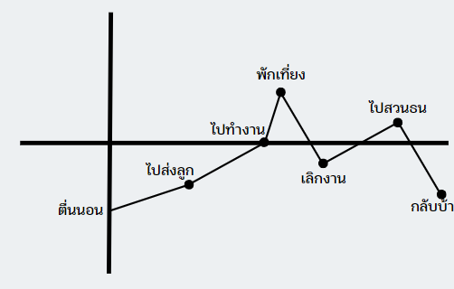

 # DEFINE
 

 # What-How-Why
__**What** : พนักงานบริษัท(พนักงานIT)__  
__**How** : ทำงานนี้มาแล้ว 5 ปี โดยเข้างานเวลาทุกวันจันทร์-ศุกร์เวลา 08.00-16.00__  
__**Why** : หาเงินเลี้ยงครอบครัว__  

# Say-Do-Think-Feel
__**Say** : ทำงาน 08.00 - 16.00 ในทุกววันพอได้มาสวนธนเหมือนได้ผ่อนคลาย__  
__**Do** : วิ่งออกกำลังกายในช่วงเวลาเย็น__  
__**Think** : บรรยากาศสานธนร่มรื่นดี แต่กลิ่นน้ำเหม็นและขยะก็เยอะ__  
__**Feel** : รู้สึกสนุก ร่มเย็น แต่ไม่ชอบกลิ่นเหม็นนิดหน่อยเพราะลูกยังเด็ก__  

# POV STATEMENT
__We met__

# JOURNEY MAP

  

